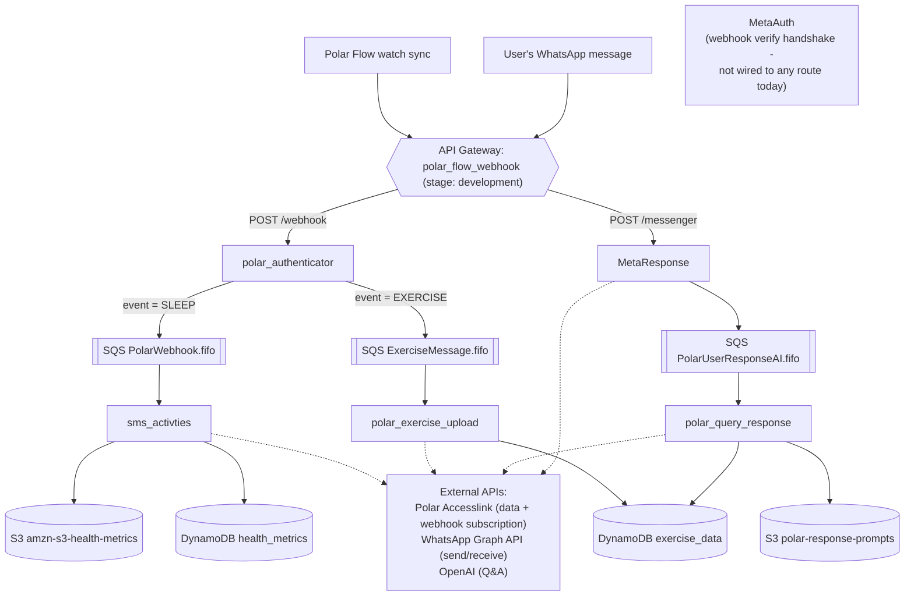

# Polar Flow Platform — Architecture

_Last updated: 2026-08-07. This is a living document — update it at the end of every migration phase, not just once at the end._

## Overview

A Polar Flow watch sync fires a webhook, which flows through several Lambdas into DynamoDB/S3, plus a WhatsApp bot bolted on the side for daily summaries and a Q&A assistant. This document is the behavioral spec for what's running today in AWS account `<OLD_ACCOUNT_ID>` ("the old account"), and the target design for the fresh rebuild in a new AWS account ("the new account"). It is not an import record — the new account is built from scratch, not adopted from the old one.

Source folders referenced below (in `~/Documents/polar_application/`, kept as read-only reference during the rebuild): `webhook_authenticator` (stale, being dropped), `sms_activities`, `polar-exercise`, `polar-response-ai`.

**A note on IDs**: AWS account IDs, the Organization ID, and the live API Gateway ID are redacted (`<OLD_ACCOUNT_ID>`, `<ORG_ID>`, `<API_GATEWAY_ID>`) rather than committed to this repo. None of these are secrets in AWS's technical sense (no credentials are exposed), but they're unnecessary reconnaissance information for a document that lives in git — the old account ID + API Gateway ID together reveal the exact live production webhook URL. The real values live in `~/.aws/config` (local, never committed) and should go into gitignored `terraform.tfvars`/CI secrets when Terraform work starts, not into markdown.

---

## Current State — Verified Understanding (old account, `<OLD_ACCOUNT_ID>`, `us-east-1`)

Confirmed directly against the live AWS account (Lambda, API Gateway, SQS, DynamoDB, S3, IAM, Secrets Manager, ECR, Organizations) plus reading the actual deployed Lambda source — local code did not always match what's deployed.

### 1. Webhook ingress — `polar_authenticator` (Lambda, zip, python3.12)
- Triggered by API Gateway REST API `polar_flow_webhook` (id `<API_GATEWAY_ID>`), stage `development`, route `POST /webhook`.
- Loads shared secret `prod/smsApp` from Secrets Manager, key `POLAR_WEBHOOK`.
- Verifies `Polar-Webhook-Signature` header as a raw hex HMAC-SHA256 of the request body (no `sha256=` prefix).
- Dispatches purely on the body's `event` field:
  - `SLEEP` → SQS `PolarWebhook.fifo` (body is the **literal string** `"Process Daily Update"`, not the actual payload).
  - `EXERCISE` → SQS `ExerciseMessage.fifo` (full raw body).
  - Any other event type is accepted (200) and silently dropped.
- No idempotency/dedup check exists in the deployed code.
- The local `webhook_authenticator` folder does **not** match this deployed code and is being dropped — this deployed code is the real starting point.

### 2. Daily notification + health backfill — `sms_activties` (Lambda, Docker, local folder `sms_activities`)
- Triggered by SQS `PolarWebhook.fifo` — fires whenever a `SLEEP` event arrives (roughly daily), not on a schedule.
- Ignores the SQS message content; every invocation runs:
  - `send_daily_notification()` — pulls recent activity via Accesslink, sends a WhatsApp summary via the Meta Graph API.
  - `upload_daily_load()` — backfills up to 10 days of health data to S3 (`amzn-s3-health-metrics/prod_health_data`) and DynamoDB `health_metrics`.
- Also owns the Polar webhook *subscription* itself (`src/app/webhooks/webhook.py`: `create_webhook()`/`update_webhook()`/`get_webhook()` against `https://www.polaraccesslink.com/v3/webhooks[/{id}]`, HTTP Basic Auth). No `delete_webhook()`. The `signature_secret_key` Polar returns on creation is not automatically persisted to Secrets Manager — manual today.
- Runs under shared `lambda-ex` IAM role.

### 3. Exercise ETL — `polar_exercise_upload` (Lambda, Docker, local folder `polar-exercise`)
- Triggered by SQS `ExerciseMessage.fifo`. Fetches exercise JSON + `.fit` binary from Accesslink, computes derived metrics (HR zones, drift, efficiency factor, pace, elevation via `fitparse`), writes to DynamoDB `exercise_data`.
- No OAuth refresh-token logic anywhere — a long-lived `access_token` in Secrets Manager is the only credential.
- `accesslink/endpoints/users.py` implements Accesslink user onboarding (`POST /v3/users`, `DELETE /v3/users/{id}`) but nothing wires it into a runnable flow today.
- Runs under `lambda-ex`.

### 4. WhatsApp inbound — `MetaResponse` (Lambda, zip, python3.14, no local source — recovered from the deployed zip)
- Triggered by API Gateway `POST /messenger`. Verifies `X-Hub-Signature-256` against secret key `META_NOT_SEC`. Extracts inbound WhatsApp text, pushes to SQS `PolarUserResponseAI.fifo` (via an env var misleadingly named `SQS_EXERCISE_QUEUE_URL`).

### 5. WhatsApp webhook verification — `MetaAuth` (Lambda, zip, python3.14, no local source — recovered from the deployed zip)
- Implements Meta's GET handshake (`hub.mode`/`hub.verify_token`/`hub.challenge`). **Orphaned** — no GET route exists anywhere in API Gateway, so it's currently unreachable.

### 6. AI Q&A response — `polar_query_response` (Lambda, Docker, local folder `polar-response-ai`)
- Triggered by SQS `PolarUserResponseAI.fifo`. Reads DynamoDB `exercise_data` for the last 90 days for a hardcoded user id, summarizes, loads a system prompt from S3, calls OpenAI (`gpt-5-mini`), replies over WhatsApp.
- This was a proof of concept. A separate webserver now exists and should be able to call this Q&A logic directly instead of only via WhatsApp.

### Shared building blocks (old account)
- **Secrets Manager**: one secret, `prod/smsApp` — Polar OAuth creds, Polar webhook signing secret, WhatsApp send token, Meta webhook verify secret. (Deliberately kept as one secret to minimize Secrets Manager cost — see Cost Considerations.)
- **IAM**: `polar_authenticator`, `MetaAuth`, `MetaResponse` each have a dedicated auto-generated role. `sms_activties`, `polar_exercise_upload`, `polar_query_response` share one over-permissioned role, `lambda-ex` (`AmazonS3FullAccess`, `AmazonDynamoDBFullAccess_v2`, `SecretsManagerReadWrite`).
- **SQS**: three FIFO queues (`PolarWebhook.fifo`, `ExerciseMessage.fifo`, `PolarUserResponseAI.fifo`), 24h retention, **no DLQ on any of them**.
- **DynamoDB**: `exercise_data` (+ `_test`), `health_metrics` (+ `_test`).
- **S3**: `amzn-s3-health-metrics`, `polar-response-prompts`.
- **ECR**: `polar-exercise-upload`, `sms-activity-notifcation`, `user-response-polar_query` (name doesn't match the Lambda name `polar_query_response`).
- **CI/CD**: none. Manual `deploy.sh` for the 3 Docker functions; no deploy path found for the 3 zip functions.
- **AWS Organization**: `<OLD_ACCOUNT_ID>` is the management account of Organization `<ORG_ID>` (all features enabled), no other member accounts yet — makes creating a clean second account for the rebuild straightforward.

### Current Architecture Diagram



*Not shown to keep this readable: the dead API Gateway root `/` integration, and the single shared Secrets Manager secret that every Lambda except `MetaAuth` reads from — both covered in Known Issues below.*

---

## Known Issues / Gaps (old account)

1. API Gateway root `/ POST` targets a deleted Lambda (`user_query_response`); `/ ANY` is a harmless `MOCK`.
2. `MetaAuth` is orphaned — not reachable from any route.
3. Local `webhook_authenticator` folder is stale/wrong — dropped, not migrated.
4. `MetaAuth` and `MetaResponse` had no local source anywhere — now recovered from deployed zips.
5. Shared `lambda-ex` IAM role is over-permissioned for the three functions using it.
6. No DLQ on any of the three SQS queues.
7. No CI/CD anywhere; no deploy path at all for the 3 zip-based functions.
8. One catch-all secret (`prod/smsApp`) mixes unrelated credentials (deliberate cost trade-off — see below).
9. `MetaResponse`'s outbound queue env var is misnamed (`SQS_EXERCISE_QUEUE_URL` actually holds the `PolarUserResponseAI.fifo` URL).
10. ECR repo `user-response-polar_query` doesn't match Lambda name `polar_query_response`.
11. No OAuth refresh-token logic anywhere.
12. Stage named `development`, but everything else assumes production — one environment today, inconsistently labeled.
13. `polar-exercise`'s `requirements-dev.txt` captured OS/system packages by accident.
14. **Cost waste**: `polar_exercise_upload` and `polar_query_response`'s CloudWatch log groups have no retention policy ("Never Expire") and already hold ~3MB/~1.8MB. The other four functions are set to 5 days. Free fix.
15. Python dependency management is inconsistent across services (`requirements.txt`, Poetry, mixed `ruff` adoption).
16. No documented/automated way to onboard a Polar user (OAuth authorize → token exchange → `POST /v3/users` → webhook subscribe) — done manually once.
17. **Security**: `polar_authenticator` parses the JSON webhook body before verifying the HMAC signature.
18. **Security**: `MetaAuth`'s `VERIFY_TOKEN` is a plaintext Lambda environment variable, unlike every other credential here.
19. **Security**: shared `lambda-ex` role grants `SecretsManagerReadWrite` — nothing here ever writes a secret.
20. **Reliability**: nothing alerts on a DLQ receiving a message, or on repeated webhook signature failures.
21. **Deploy hygiene**: `deploy.sh` pushes `:latest` to ECR — no traceability, no rollback path.

Since the rebuild happens in a brand-new account rather than importing in place, every one of these is free to fix — there's no live-resource-renaming constraint.

---

## Decisions

| Question | Decision |
|---|---|
| Source for `MetaAuth`/`MetaResponse`/real `polar_authenticator` | Adopt the recovered deployed code as the starting point. |
| Git history for the 3 existing GitHub repos | Fresh start — clean history in the new monorepo; old repos stay on GitHub as archives. |
| `webhook_authenticator` local folder | Drop entirely. Replace with a proper onboarding/webhook-setup tool. |
| Target AWS account | New account under the existing Organization. Validate end-to-end, cut Polar's/Meta's webhook registrations over, then decommission the old account. |
| Terraform strategy | Greenfield `apply` in the new account — no import needed. |
| Resource/service naming | Free to rename anything for consistency. |
| `polar-response-ai` / WhatsApp future | Decouple only: pull core Q&A logic into a plain callable module now; build the webserver integration itself later. |
| Python tooling | Standardize on `uv` + `ruff` + dependency/container security scanning across every service. |
| Secrets structure | Keep minimal (one, or at most two) rather than fully split by purpose — the single-secret design was a deliberate cost decision. |
| Repo location | `~/Documents/prod/polar-flow-platform` (this repo) — new sibling to the existing four folders, which stay untouched as reference during the rebuild. |

---

## Cost Considerations

- **Secrets Manager** (~$0.40/secret/month + $0.05/10k calls): fully splitting `prod/smsApp` by purpose would cost roughly +$1.20/month for ~4 secrets. Kept to one or two instead, preserving most of the blast-radius benefit for a fraction of the cost.
- **CloudWatch Logs retention**: fixing the 2 log groups with no retention policy is a pure saving, not a new cost.
- **SQS DLQs**: effectively free at this traffic volume (1M requests/month free tier).
- **Least-privilege IAM roles**: free.
- **ECR**: ~$0.10/GB/month for stored images; a lifecycle policy (keep last 5 images) caps this.
- **New AWS account**: free to create under the existing Organization. Brief overlap running both accounts during cutover is single-digit-cents at this traffic volume.
- **GitHub Actions**: free tier comfortably covers this project's size.
- **Terraform state backend** (S3 + DynamoDB): a few cents/month.

Net effect: roughly the same or slightly less than today's spend, once the log-retention fix lands.

---

## Target State

### New AWS account
A member account under Organization `<ORG_ID>`, dedicated to this application. Terraform's remote-state backend (S3 bucket + DynamoDB lock table) is bootstrapped inside the new account.

### Repo layout

```
polar-flow-platform/
├── docs/
│   └── architecture.md          # this file
├── terraform/
│   ├── bootstrap/                # one-time: new-account state bucket + lock table
│   ├── modules/
│   │   ├── lambda_function/      # zip- or image-based Lambda + least-privilege role + log group
│   │   ├── sqs_fifo_queue/       # queue + DLQ + redrive policy
│   │   └── dynamodb_table/
│   └── environments/
│       └── prod/                 # everything, built fresh in the new account
├── services/
│   ├── webhook-authenticator/    # was polar_authenticator
│   ├── whatsapp-webhook-verify/  # was MetaAuth
│   ├── whatsapp-inbound/         # was MetaResponse
│   ├── exercise-etl/             # was polar_exercise_upload / polar-exercise
│   ├── health-sync/              # was sms_activties / sms_activities
│   ├── exercise-insights/        # was polar_query_response / polar-response-ai
│   │   ├── core/                 #   transport-agnostic Q&A logic
│   │   └── whatsapp_adapter/     #   today's SQS-triggered WhatsApp transport
│   └── polar-onboarding/         # NEW: CLI for user onboarding + webhook subscription management
├── libs/
│   └── polar_common/             # shared config_loader / logging_config / push_notifications (uv workspace member)
└── .github/workflows/
    └── service-ci.yml
```

**As-built note (2026-08-07)**: this diagram is the original target-state plan, kept as-written for the historical record rather than silently edited — three things diverged from it during the actual build, all worth tracking as real (not aspirational) gaps:
- **CI/CD ended up as separate workflow files**, not one `service-ci.yml`: `test.yml`, `security-scan.yml`, and `deploy-service.yml` today (plus `terraform-plan.yml`/`terraform-apply.yml`, built at step 7 and later removed — see that step's revision note). This split is fine on its own merits (each has a different trigger/permission scope) but was never reconciled with this diagram until now.
- **`libs/polar_common/` was never built.** `config_loader.py`/`logging_config.py`/WhatsApp `push_notifications` remain duplicated near-verbatim across 4+ services, each still carrying the identical `TODO #38` marker from before this migration started. See the Open Items list below — tracked there as a genuine, still-open gap, not silently dropped.
- **`app/polar_web_app/` (new top-level directory, not in this diagram at all)** — an AI running-coach web app added later, outside the original 10-step migration plan (it was explicitly flagged as a deferred future direction in Open Items, not part of Target State when this diagram was written). See its own [README](../app/polar_web_app/README.md), Migration Roadmap item 11, and Review 6 below.

**Container images**: one ECR repo per Docker-based service (`exercise-etl`, `health-sync`, `exercise-insights`), created by Terraform in the new account. Git holds the Dockerfile/source; ECR holds the built image, tagged by git SHA (never `:latest`). CI authenticates via GitHub OIDC federation — no long-lived AWS keys in GitHub.

### `polar-onboarding` tool (new)
Replaces the manual, undocumented onboarding steps:
1. **Authorize a user** — OAuth2 authorization-code flow (open Polar's authorize URL, capture the redirect callback, exchange code for token). Nothing in the codebase handles the callback today.
2. **Register the user** — `POST /v3/users` (reuses existing `Users.register()` from `polar-exercise`).
3. **Create/update the webhook subscription** — reuses/extends `sms_activities`'s `create_webhook()`/`update_webhook()`/`get_webhook()`, additionally persisting the returned `signature_secret_key` into Secrets Manager automatically.
4. **Point at a target API Gateway URL** — used for first-time setup and for the old→new account cutover.

*Verified against Polar's live admin portal + OpenAPI spec at step 6b — the endpoints/field names below already matched exactly.*

### Q&A decoupling (`exercise-insights`)
- `core/`: `answer_question(user_id: str, question: str) -> str` (or a small typed request/response shape) — no AWS-transport awareness, fully unit-testable.
- `whatsapp_adapter/`: today's SQS-triggered Lambda — parses the message, calls `core/`, sends the result over WhatsApp.
- Nothing webserver-facing is built yet; wiring the webserver in later means calling `core.answer_question(...)`.

### Testing strategy
- **Done**: every service's test suite now runs fully offline — `moto` mocks AWS (DynamoDB/S3/Secrets Manager), `responses` mocks `requests`-based HTTP calls (Polar Accesslink, WhatsApp Graph API), and `respx` mocks the `httpx`-based OpenAI SDK. All 258 tests across all 7 services pass with zero `.env` file and zero real AWS credentials (verified in a fully cleared environment). There is currently no separate "integration" tier — every test that could plausibly need real credentials turned out to be convertible to a fast offline unit test instead.
- Real end-to-end/integration testing against the new account's actual `_test` DynamoDB tables and a live (non-production) Polar/Meta webhook belongs at the validation step below (step 8), not as a per-service unit-test tier.
- `exercise-insights/src/core/transform/{exercise,health}.py` (previously the last untested transform modules in the repo) now have dedicated tests, matching the coverage every other service's equivalent module already had. Writing them surfaced two more real bugs — see `services/exercise-insights/README.md` for specifics (an operator-precedence bug that made every load-trend report "increasing" regardless of the real data, and an `UnboundLocalError` that crashed on sparse data).
- **Done**: `exercise-etl` and `health-sync`'s Lambda entrypoints (`main.py`/`lambda_handler`), `oauth2.py` (OAuth token-exchange/refresh logic), `config_loader.py` (Secrets Manager), and `extractor.py` (the Accesslink-calling business logic — date-window math, per-endpoint error handling, the physical-info DynamoDB fallback, the day-of-week extraction decider) all went from largely-untested to dedicated coverage, as a direct follow-up to a three-hat repo review that flagged the entrypoints as the biggest blind spot. Writing these surfaced four more real bugs, all fixed at the source: two `logging.error("...: %e", e)` calls in `main.py` (should have been `%s` — `%e` against an exception object made the *logging call itself* fail, silently swallowing the real error into logging's own internal error handler instead of logging it); and two copies of the same bug in `extractor.py`'s date-fallback code, where the warning message referenced a local variable before it was ever assigned (`UnboundLocalError`) and, once fixed, a second issue where the fallback value was a raw `datetime` object instead of the string format every other branch used (breaking the DynamoDB string-keyed lookup that consumes it).
- **Done**: per-service coverage gates (`[tool.coverage.report] fail_under` in each `pyproject.toml`), calibrated to each service's real, current numbers plus a small buffer — not aspirational targets that would fail on day one. Current: `exercise-etl` 82% (gate 80), `health-sync` 82% (gate 80), `exercise-insights` 78% (gate 75), `polar-onboarding` 98% (gate 95), `webhook-authenticator` 92% (gate 90), `whatsapp-webhook-verify` 93% (gate 90), `whatsapp-inbound` 89% (gate 85). Remaining known gaps, deliberately deferred as lower-value (thin, mostly-declarative Accesslink endpoint wrapper classes; `exercise-etl`'s `fit_file_helper.py`; `health-sync`'s `daily_helper.py`/`utils.py`) rather than chased for their own sake.
- **Done**: `.github/workflows/test.yml` runs every service's test suite under `coverage` on every push/PR, matrixed per service; the coverage gate above is enforced there (the job fails if a service drops below its `fail_under`), and a per-service coverage summary + HTML report artifact is published on every run.
- Idempotency test: replaying the same webhook twice must not duplicate DynamoDB writes, WhatsApp sends, or OpenAI calls.
- `terraform validate` + `tflint` + a policy scanner (`tfsec`/`checkov`) in CI, gating on high/critical findings.
- Rehearse the rollback (pointing Polar/Meta back at the old account) before cutover, not during an incident.

### Shared code
A `uv` workspace with one shared internal package (`libs/polar_common`) for `config_loader`/`logging_config`/WhatsApp `push_notifications`, currently duplicated near-verbatim across 4+ services. Each service still builds/deploys independently.

### Deploy hygiene and drift prevention
- No manual console edits to anything Terraform manages (this is exactly how `webhook_authenticator` drifted from the real deployed code).
- Branch protection: CI (tests + lint) must pass before merge to `main`; `main` is what CI/CD deploys from.
- Immutable image tags (git SHA), not `:latest`.

### Observability (minimal, not gold-plated)
Skipping X-Ray, WAF, and a customer-managed KMS key as unnecessary for this threat model/traffic. Adding one cheap, high-value thing: a CloudWatch Alarm → SNS/email on any DLQ message, and on repeated signature-verification failures.

### Tooling standardization
- **Done**: `uv` for every service (`pyproject.toml` + `uv.lock`), replacing the mix of `requirements.txt`/Poetry/plain venvs.
- **Done**: `ruff` (lint + format) at a repo-root config, clean across the whole tree.
- **Done**: `bandit` (Python security linting) at a repo-root config, clean across the whole tree with zero suppressions — every finding was fixed at the source (see commit history for the OAuth-URL-naming false positives and the dead, timeout-less webhook script that got deleted rather than patched).
- Dependency vulnerability scanning (`pip-audit`) and container image scanning (Trivy) in CI — pending.
- Dockerfiles rewritten around `uv sync --frozen` — pending.

### Fixes baked into the rebuild
- **Done** (step 6): real GET route for `whatsapp-webhook-verify` (`/messenger`, shared with `whatsapp-inbound`'s POST — Meta's actual convention).
- **Done** (step 6, implicitly): no dead root integration — the new API Gateway only ever had `/webhook` and `/messenger` defined, nothing to drop.
- **Done** (step 6): per-service least-privilege IAM roles, scoped to specific resource ARNs — no shared `lambda-ex`, no `SecretsManagerReadWrite` (`secretsmanager:GetSecretValue` only, and read-only `dynamodb:Query`/`GetItem` for `exercise-insights` specifically, since its real call path never writes).
- **Done** (step 6): DLQ + redrive policy on all three SQS queues.
- **Done** (step 5c/6): secrets kept minimal — one secret (see Cost Considerations and `terraform/environments/prod/README.md`'s "Secret keys" table for the full rationale, including why splitting further isn't a pure Terraform decision).
- Fix the misnamed outbound-queue env var in `whatsapp-inbound` — already done in step 4a; step 6's Terraform sets the corrected `SQS_USER_QUERY_QUEUE_URL`.
- **Done** (step 6): consistent naming between Lambda functions, ECR repos, and SQS/DynamoDB resources (each Lambda's name matches its ECR repo name exactly; queues renamed to `polar-webhook.fifo`/`exercise-message.fifo`/`user-query.fifo`).
- **Done** (step 6): consistent CloudWatch log retention (14 days) across every function.
- **Done** (step 6): ECR lifecycle policy (keep last 5 images) per repo.
- `webhook-authenticator` verifies HMAC *before* touching the parsed body — already done in step 4a.
- **Done** (step 6): `MetaAuth`/`whatsapp-webhook-verify`'s verify token lives in Secrets Manager (`META_VERIFY_TOKEN`), not a plaintext env var.
- Terraform's own state backend: S3 versioning + encryption + public-access-block + DynamoDB lock table — done in step 3. GitHub OIDC trust policy scoped to this repo only — still pending, step 7 (needs the CI/CD deploy workflow to exist first).

---

## Migration Roadmap

- [x] 1. Repo + docs baseline — this repo, this file, as the first commit.
- [x] 2. New AWS account under the existing Organization (`polar-app-prod`; access via a local `polar-app-prod` CLI profile using `OrganizationAccountAccessRole`).
- [x] 2b. **Moved up from step 5, per your steer to catch leaks/security issues early rather than late**: gitleaks pre-commit hook (fast, staged-diff, offline) + a full-history gitleaks scan in CI on every push/PR. Placeholders added in `.github/workflows/security-scan.yml` for `tfsec`/`checkov`, Trivy, and `pip-audit` once Terraform/Docker/`uv` content exists to scan.
- [x] 3. Bootstrap Terraform remote-state backend in the new account (`terraform/bootstrap/`). S3 bucket `polar-flow-platform-tfstate-fda6588e` (versioned, AES256 encrypted, public access blocked, `BucketOwnerEnforced`) + DynamoDB lock table `polar-flow-platform-tfstate-lock` (pay-per-request). Bucket name is an opaque random suffix, not derived from the account ID, deliberately — see `terraform/bootstrap/README.md`.
- [x] 4a. Bring in the 6 real services — `exercise-etl`, `health-sync`, `exercise-insights` (split into `core/`+`whatsapp_adapter/`) from the local folders; `webhook-authenticator`, `whatsapp-webhook-verify`, `whatsapp-inbound` recovered from deployed zips. `webhook_authenticator` dropped entirely (stale, never matched deployed code). Every service also got: a real gitleaks/PII sweep before committing (several real fixes - see each service's README), and the three recovered-from-zip services got their first-ever test suite (moto-mocked, verified passing). One breaking env var rename flagged: `whatsapp-inbound`'s outbound queue var is now `SQS_USER_QUERY_QUEUE_URL`, not the old misleading `SQS_EXERCISE_QUEUE_URL`.
- [x] 4b. `polar-onboarding` built (new code, not a migration) - CLI for OAuth authorize, user registration, and webhook create/update/get/delete, grounded in Polar's real Accesslink docs. 13 tests passing. All 7 services now in `services/` with passing test suites.
- [x] 5a. Standardize tooling — every service converted to `uv` (`pyproject.toml`+`uv.lock`); repo-root `ruff` (clean) and `bandit` (clean, zero suppressions) added. Along the way, replaced env-var-dependent/assertion-free tests with `moto`/`responses`/`respx`-backed ones testing real status codes and example payloads instead of blind mocks — surfaced and fixed several real bugs (a `uuid4()` default evaluated once at import time, module-level Secrets Manager calls breaking testability, a WhatsApp message-splitter that silently mis-split on every long message, a checklist-joining bug producing unreadable notifications, and a dead/timeout-less manual webhook script deleted in favor of `polar-onboarding`). All 117 tests across all 7 services now pass in a fully clean environment. See each service's README and the commit history for specifics.
- [x] 5b. Rewrote the 3 Docker-based services' Dockerfiles as multi-stage builds around `uv export`+`uv pip install --target`; each was actually built and its real `lambda_handler` entrypoint imported inside the resulting container. Wired `bandit` and `pip-audit` into `.github/workflows/security-scan.yml` (both run locally and verified — `pip-audit` caught real CVEs in `python-dotenv`/`requests` pins, fixed by bumping versions) and `Trivy` for container scanning (config only — see the workflow file's note on why the local equivalent couldn't be run end-to-end in this dev sandbox). `tfsec`/`checkov` remain a placeholder pending step 6's real Terraform content.
- [x] 5c. Three-hat (security/testing/developer) review of the whole repo ahead of the publish decision — private repo recommended (see "Three-Hat Reviews" below for the full write-up). The review's one real "must-fix before relying on this for prod" finding — no CI ran the test suites at all — is now closed: `.github/workflows/test.yml` runs all 244 tests under `coverage` on every push/PR, matrixed per service, gated on each service's `fail_under` threshold (see Testing strategy above), with a per-service summary + HTML coverage artifact on every run. Also closed as part of the same pass: `exercise-etl`/`health-sync`'s previously-untested Lambda entrypoints, OAuth logic, and Accesslink-calling business logic (see Testing strategy above for the bugs that surfaced). A second review pass confirmed this closure and found no new blockers. A third pass, after the first real push to GitHub, found both CI workflows failing completely — see Review 3 below for the real bugs that surfaced only once running on an actual clean GitHub runner (not a locally-validated one), all fixed and now green on `main`.
- [x] 6. Terraform for the new account — 3 modules (`dynamodb_table`, `sqs_fifo_queue`, `lambda_function`) + `environments/prod`, wiring all 6 real services (`polar-onboarding` stays a local CLI, not deployed), with every fix from the old-account issues list baked in: DLQs on all 3 queues, least-privilege per-Lambda IAM roles (no shared `lambda-ex`, no `SecretsManagerReadWrite`), a real GET route for `whatsapp-webhook-verify` (fixing it being orphaned), `prod` stage naming, ECR lifecycle policies, immutable image tags, and DLQ/signature-failure CloudWatch alarms → SNS. `terraform validate` and a real `terraform plan` against the actual new account (`<NEW_ACCOUNT_ID>`, read-only, no `apply` run) both pass clean: 83 resources to add, 0 to change, 0 to destroy. Two real bugs caught by that real plan (not by `validate`, which doesn't talk to AWS): the S3 backend block was silently authenticating with the wrong AWS profile (403 against the state bucket - backend blocks can't reference variables, so `var.aws_profile` never reached it), and the pinned AWS provider version (`~> 5.0`) didn't recognize `python3.14` as a valid Lambda runtime despite AWS actually supporting it - fixed by bumping to `~> 6.0` (checked its upgrade guide first; nothing else it changes affects any resource used here). See `terraform/environments/prod/README.md` for the real bootstrap order this needs (an ECR image must exist before its Lambda can be created; the shared secret's real values are deliberately never set through Terraform) - `apply` has not been run against the real account, pending your go-ahead.
- [x] 6b. **Verified `polar-onboarding`'s endpoints/flow against Polar's real Accesslink admin portal and OpenAPI spec** (not just the existing code, which turned out to already match exactly): partner registration at `admin.polaraccesslink.com` (manual, human, no API), OAuth authorize/token URLs, `POST /v3/users`, and the full `/v3/webhooks` CRUD set (plus previously-undocumented `POST /v3/webhooks/activate`/`deactivate`, not currently used by `polar-onboarding` — noted, not implemented, since nothing here needs to pause a subscription without deleting it). Confirmed the response's `signature_secret_key` is genuinely one-time-only per Polar's own docs, which is exactly why `webhook create --store-secret-name` auto-persists it rather than expecting a human to copy it. Documented the real onboarding sequence (register for API access → `authorize`/`register` → `webhook create`, in that order, before secrets can be fully populated) in `terraform/environments/prod/README.md` and called out from the root README. Also closed a real gap this surfaced: `exercise-insights`' `POLAR_USER_ID` was a hardcoded empty string in `lambda.tf` with no variable to actually set it post-onboarding — added `var.polar_user_id`, wired it through, `terraform plan` confirmed clean (default `""` matches what's already deployed).
- [x] 7. Finish CI/CD — GitHub Actions OIDC federation (`terraform/environments/prod/cicd.tf`), two IAM roles split by blast radius: `gha-terraform-plan` (read-only, assumable from any workflow run incl. PRs) and `gha-deploy` (write, scoped per-resource-ARN wherever AWS's IAM model allows it, trust-policy-restricted to `refs/heads/main` only). `terraform-plan.yml` runs on every PR touching `terraform/**`, posts the plan as a PR comment. `terraform-apply.yml` and `deploy-service.yml` are **manual `workflow_dispatch` only, never automatic on merge** — decided explicitly with the repo owner rather than defaulting to auto-apply, consistent with how every real apply this whole migration has gone through an explicit human go-ahead. Also turned the long-stale `terraform-security` placeholder in `security-scan.yml` into a real job (Trivy config scan — tfsec is deprecated upstream, merged into Trivy in 2024, so no second scanner tool) once someone actually asked whether it existed; found and fixed one real gap for free (SNS alerts topic had no encryption at all — now uses the AWS-managed key), and suppressed two already-decided no-CMK tradeoffs plus 4 confirmed Trivy false positives (a documented `for_each`-linking limitation — verified by reading the config directly, not assumed). See each workflow file's comments for the full reasoning.

  **Revised 2026-08-07**: dropped the Terraform-apply half of this entirely, in favor of a manual local `terraform apply` (`polar-app-prod` profile) after PR review — simpler for a solo repo than the `workflow_dispatch`/`confirm=APPLY` gate, and it permanently retires the risk class behind Review 4's hung-`apply` incident below (`apply` no longer runs unattended in CI, ever). `terraform-apply.yml` and `terraform-plan.yml` are both deleted; `gha-terraform-plan` is removed (no remaining caller); `gha-deploy`'s policy is pruned from the broad terraform-apply-era grants down to only what `deploy-service.yml` calls (ECR push/auth, `lambda:UpdateFunctionCode`/`GetFunction`, `sts:GetCallerIdentity`). Docker-image CD (`deploy-service.yml`) is unchanged. Same session: added `concurrency`/`cancel-in-progress` to `test.yml` and `security-scan.yml` — neither had it, so every push to a PR spawned a full 20-job run with nothing cancelling a now-stale prior run; PR #9's 8 individually-pushed fix commits are the likely source of ~800 CI minutes burned in one day. Same PR also fixes a live `AccessDenied` on `dynamodb:DescribeTable` for `exercise-etl-lambda-role`, hit during a real watch sync — its policy only ever granted `PutItem`/`GetItem`.
- [ ] 8. Validate in the new account end-to-end — synthetic webhooks, idempotency test, DLQ/alarm checks, rollback rehearsal. **In progress**: a real, live walkthrough of `terraform/environments/prod/README.md`'s bootstrap sequence (not just a read-through) surfaced and fixed 8 real, distinct bugs — each root-caused directly against live CloudWatch/CloudTrail evidence, not assumed from reading code, on branch/PR `fix/whatsapp-webhook-and-onboarding-cli` (#9):
  1. All 3 zip-based Lambdas' `handler` attribute didn't match the actual deployed zip layout (`terraform/modules/lambda_function`'s `archive_file` zips `source_dir`'s *contents*, not the directory itself, so the zip root is `app/…`, not `src/app/…`) — broke `POST /webhook` and both `/messenger` routes identically, confirmed via `Runtime.ImportModuleError` in CloudWatch. Fixed the Terraform `handler` string in all three module blocks.
  2. The identical class of bug, independently, inside each handler's own internal import (`from src.app.config_loader import …`) — invisible to every test run because the local `-t .` test layout differs from the deployed zip layout by design (see `CLAUDE.md`'s Known gotchas). Fixed with a relative import (`from .config_loader import …`) instead of another absolute path, so it's correct under both layouts regardless of which package name applies; verified against a simulated copy of the real zip for all 3 services.
  3. The bootstrap doc had the Meta/WhatsApp secret-population step happen *after* the webhook-subscribe step that needed `META_VERIFY_TOKEN` already present — guaranteeing Meta's live verification would fail on any fresh account. Reordered.
  4. Both "populate the secret" steps used a plain, overwriting `put-secret-value` despite a comment claiming read-modify-write — would have silently wiped `POLAR_WEBHOOK`. Replaced with a real `get-secret-value` → `jq` merge → `put-secret-value` sequence, verified locally against both the empty-secret and existing-value cases.
  5. `webhook-authenticator` crashed (`KeyError: 'POLAR_WEBHOOK'`) on Polar's create-webhook PING verification request — that ping is signed with the very `signature_secret_key` the same create call is about to return, so it can't be verified like a real event on a fresh account. Fixed by accepting `Polar-Webhook-Event: PING` unconditionally, before any secret lookup (it carries no payload and this handler takes no action on it regardless).
  6. `polar-onboarding`'s doc examples used bare-word placeholders (`--client-id ID`) inconsistent with this repo's `<angle-bracket>` convention, which led to a literal `--client-id ID` being typed — normalized the convention repo-wide, and separately discovered `<angle-brackets>` are themselves unsafe inside a live shell command line (bash input-redirection syntax) — fixed with `.env`/env-var fallback for `client_id`/`client_secret` and interactive `read` prompts for one-off values instead.
  7. `--store-secret-name` silently failed to persist `signature_secret_key` — Polar's real response wraps it in a `data` envelope that the extraction code read past; a stale, inconsistent test mock had hidden this. Fixed the extraction path and the mock. Also gave `polar-onboarding` a real `--aws-profile` mechanism — it previously had none at all and silently fell back to whatever the ambient default AWS credentials were (the *old* account on this machine), independently confirmed real but not the cause of this specific incident.
  8. Confirmed via CloudTrail (the secret's ARN suffix changing, which Secrets Manager assigns once, permanently, at creation) that a `terraform destroy` — including a deliberate `docs/runbooks/teardown-rehearsal.md` cycle — wipes the *entire* Secrets Manager secret, not just whichever keys are top of mind. Clarified in the runbook.
  9. `terraform apply` for PR #9's fixes ran for real on 2026-08-07, and the first real Polar watch sync since surfaced two more live incidents on the EXERCISE path specifically, fixed on PR #10 and PR #11:
     - `exercise-etl-lambda-role` was missing `dynamodb:DescribeTable` — a real watch sync hit `AccessDeniedException`. Fixed by adding the permission to `exercise_etl`'s IAM policy in `lambda.tf` (PR #10). Same PR also dropped the Terraform-apply CD workflows in favor of a manual local `terraform apply` (see step 7's revision note) and added `concurrency`/`cancel-in-progress` to `test.yml`/`security-scan.yml` after ~800 CI minutes were burned in one day from uncancelled superseded runs.
     - Checking whether the failed message could be redriven found it couldn't: both `exercise-message.fifo` and its DLQ showed 0 messages, because `exercise-etl`'s `run_app()`/`lambda_handler()` caught every failure and returned a normal-looking dict instead of raising — so the Lambda always reported success to SQS regardless of whether processing actually worked, and SQS deleted the message on the first attempt instead of retrying/DLQ'ing it per `maxReceiveCount: 3`. Auditing the other 2 SQS-triggered Lambdas found the identical bug class in both `health-sync` and `exercise-insights` (`whatsapp_adapter`) — all 3 fixed to raise on real failure (PR #11). `health-sync` needed extra care: notifications fail often in practice (test numbers etc.), and a retry must never re-send an already-successful notification or duplicate a DynamoDB record. Solved without new infra by reordering `run_app()` so the DynamoDB upload runs *before* the WhatsApp notification (previously the reverse) — verified safe because `Health_Record.add_record` is a plain keyed `put_item` (idempotent overwrite) and `upload_daily_load`'s backfill loop resumes from `get_latest_date()` on every call, so notification becomes the terminal step: a message is only deleted from SQS once notification has actually sent. Independently confirmed `webhook-authenticator`'s ACK to Polar is fully synchronous and decoupled from any downstream Lambda's success/failure, so this fix only changes SQS's own retry/DLQ behavior, never what Polar sees.
     - The specific exercise lost to the above was recovered as a live operational action (not a code change, not part of either PR): found via Polar's Accesslink API (`Extractor().get_exercises()` — the only match in the last 30 days: `RUNNING`, started `2026-08-07T07:23:07`), reprocessed by invoking the deployed `exercise-etl` Lambda directly with a synthetic event bypassing SQS, and verified landed in the real `exercise_data` DynamoDB table.

     Reusable lessons from all of the above are captured in `CLAUDE.md`'s Known gotchas (zip-Lambda import layout, doc placeholder conventions, destroy-wipes-the-whole-secret) so a fresh session doesn't rediscover them from scratch. **Item 9 confirms the EXERCISE path specifically now flows real Polar data end-to-end for real** (webhook → SQS → `exercise-etl` → DynamoDB). Still remaining before this step can close: a real Polar `SLEEP` sync flowing through `health-sync` to an actual WhatsApp message, and Meta's webhook verification succeeding in the portal — neither confirmed yet, since today's real-world activity was all on the EXERCISE path.
- [ ] 9. Cutover — repoint Polar's and Meta's webhook registrations at the new account via `polar-onboarding`.
- [ ] 10. Decommission the old account's resources after a burn-in period (separate, explicit approval when we get there).
- [x] 11. **AI running-coach web app (`app/polar_web_app/`)** — a separate initiative, not part of the original 10-step plan above (was Open Items' "fold exercise-insights into a FastAPI web app," deferred until step 8's end-to-end validation; closed here since real exercise data is now confirmed flowing per step 8, item 9). `exercise-insights` renamed `src` → `exercise_insights` and gained a reusable `get_exercise_metrics()` so the web app can call it directly as a Python import, verified against the real deployed Lambda shape (real `docker build` + real handler invoke) before merging, since the rename touches its deployed import path. The app itself: coach-persona system prompt, conversational onboarding for a first-time athlete profile, S3-backed profile + conversation persistence (one object per user) so training data/history isn't re-sent every turn, Anthropic prompt caching, Claude-Code-style slash commands (`/profile`, `/update-profile`, `/refresh-data`, `/help`). Deploys as a **private GHCR Docker image pulled onto a Raspberry Pi at home — not AWS** (`deploy-web-app.yml`, manual `workflow_dispatch` only; `docs/runbooks/raspberry-pi-web-app.md`). Terraform (`terraform/environments/prod/web_app.tf`): a hardened S3 context bucket + a least-privilege IAM user (`rpi-web-app`) scoped to exactly `exercise_data` read + that bucket read/write, following the existing secret-container pattern (Terraform creates the identity, the access key is generated out-of-band, never touches state). Historical-data backfill script + runbook (`scripts/backfill_from_old_account.py`, `docs/runbooks/data-migration-backfill.md`) for the old account's two DynamoDB tables — deliberately sequenced last, dry-run by default. Landed as PR #13; CI (`Test`, `Security scan`) green before merge — see that run for the pip-audit break the rename caused and its fix. **Review 6** below is this item's three-hat review, done same-day per `CLAUDE.md`'s "before starting a new major roadmap phase" convention, applied here as "after landing one," since the review only makes sense once real code exists to review. Still outstanding, deliberately not done as part of this item: `terraform apply` for `web_app.tf`, generating the RPi's access key, the real Raspberry Pi deploy, and the backfill script's real `--execute` run.

### Verification
- `terraform plan` in the new account's `environments/prod` should be clean/idempotent after `apply`.
- Each service's existing unit tests run in CI before any deploy; `ruff` and dependency/image scans gate merges.
- End-to-end validation happens before cutover; cutover is verified with a real watch sync, with the old account left intact as a fallback until decommissioning.

## Three-Hat Reviews (Security / Testing / Developer)

Conducted at major roadmap milestones — before any repo-visibility decision, and before starting a new major phase — rather than only at the end. Findings and their resolution live here so status doesn't have to be re-derived from chat history.

### Review 1 — after step 5b, ahead of the publish decision

- **Security**: full-history + working-tree secret re-scans clean; local `terraform.tfstate` (contains the real new-account ID) confirmed correctly gitignored and never tracked; `security-scan.yml`'s trigger safe today (only uses the default `secrets.GITHUB_TOKEN`), but flagged that any future OIDC/deploy-credentialed workflow must never run with real credentials on `pull_request` from external forks — a requirement to design in from the start at step 6/7, not retrofit.
- **Testing**: 148 tests, fully offline, but **no CI workflow ran them at all** — only `security-scan.yml` existed. Flagged as the one real "must-fix before relying on this for prod" item.
- **Developer**: tooling consistent (`uv`/`ruff`/`bandit` clean); minor stray `print()`s and old `TODO`s noted, not urgent; no LICENSE/CODEOWNERS (irrelevant for a private solo repo).
- **Recommendation**: private repo. Rationale: this manages a real production AWS account; a malicious PR is a real risk once deploy credentials exist in CI, and a private repo removes the fork-PR attack surface entirely rather than relying on workflow-trigger discipline alone.
- **Resolution**: closed by adding `.github/workflows/test.yml` (see step 5c) and by closing the biggest untested blind spot — `exercise-etl`/`health-sync`'s Lambda entrypoints, which were previously at 0% coverage.

### Review 2 — after step 5c (this CI job + coverage push)

- **Security**: re-verified clean (full-history `gitleaks`, tracked-file grep for the real account/API-Gateway/Org IDs, `.coverage`/`htmlcov/` confirmed gitignored and never tracked). `test.yml` audited specifically for the fork-PR risk flagged in Review 1 — it references no `secrets.*`, so it's safe to run on any PR including forks today. That property has to be *preserved deliberately*, not assumed, once step 6/7 adds real deploy credentials to a workflow. No new findings.
- **Testing**: Review 1's one real gap is closed — `test.yml` runs all 244 tests under `coverage` on every push/PR, gated per-service (`fail_under` in each `pyproject.toml`). Verified directly by re-running `uv sync --locked` (the literal CI step) against every committed lockfile — no drift. Coverage went from a 45-93% spread (two services under 70%, both Lambda entrypoints at 0%) to 78-98%, with four real bugs fixed as a byproduct rather than padding the number. Remaining below-average spots (thin Accesslink endpoint wrappers, `fit_file_helper.py`, `daily_helper.py`) are deliberately deferred, not silently dropped.
- **Developer**: `ruff`/`bandit` still clean tree-wide; new `test.yml` follows the same action-version-verification discipline as `security-scan.yml`. Same minor, pre-existing items as Review 1 (4 stray `print()`s, 6 old `TODO`s) — unchanged, not newly introduced.
- **Recommendation**: private repo — unchanged. This session's work makes the repo demonstrably closer to "manages a real prod AWS account," which reinforces rather than changes the call.
- **No blockers found for proceeding to step 6/7.**

### Review 3 — after the first real push to GitHub

Both CI workflows failed completely on the first real push — a good reminder that `terraform plan`/local test runs verify different things than a clean CI runner does. Three real, distinct bugs, all fixed and re-verified green on `main`:
- `astral-sh/setup-uv@v9` doesn't exist as a tag (only full semver like `v9.0.0` is published) - GitHub couldn't resolve it, failing every job that used it.
- `gitleaks/gitleaks-action@v2`'s default push-diff mode broke with "unknown revision" because this repo's push history has a root commit with no parent to diff from - replaced with a direct CLI call that scans the whole history unconditionally, matching what the job's name already promised.
- Real HIGH CVEs (`gawk`, `glib2`, `rpm`) baked into AWS's current `python:3.12` Lambda base image, affecting all 3 Docker services - not this repo's code, not reachable through anything the Lambda handlers do. Suppressed by CVE ID with rationale and a re-check date in `.trivyignore`, not by lowering the severity gate.
- Separately, `exercise-etl`/`health-sync` failed with `NoRegionError` - the test suites were never actually hermetic; they silently relied on the dev sandbox's `~/.aws/config` having a default region, and `tests/__init__.py`'s dummy-credentials fix didn't even execute under the `unittest discover -s tests` invocation used everywhere (no `-t .`, so `tests/` was treated as its own top-level dir). Fixed both - see `CLAUDE.md`'s Known gotchas.
- **Attempted, blocked by plan tier**: GitHub branch protection on `main` (`gh api .../branches/main/protection` → 403, "Upgrade to GitHub Pro or make this repository public"). Same GitHub Advanced Security gate also blocked SARIF upload from the gitleaks job. Decided to stay on Free/private and enforce the branch+PR workflow by convention instead of a GitHub-enforced rule — see `CLAUDE.md`'s "Git workflow" section.

### Review 4 — cloud-devops-style audit of the whole terraform/ tree, prompted by a real incident

Prompted by a hung `terraform-apply.yml` dispatch (the `gha-deploy` trust-policy verification from the previous Open Item). What actually happened, in order:
1. `gha-deploy`'s trust policy worked on the first real dispatch from `main` (no repeat of the sub-claim issue) - closing that Open Item.
2. `terraform plan` then hit 3 more rounds of missing read-only permissions on `gha-deploy` (the same category of gap as `gha-terraform-plan`'s DynamoDB-lock-table fix: a write-scoped policy alone isn't enough, since plan/apply refreshes the full state of every resource in the config, not just what a given run changes) - `iam:GetOpenIDConnectProvider`, `ecr:GetLifecyclePolicy`, `logs:DescribeMetricFilters`, `sns:GetSubscriptionAttributes`, `iam:GetRole`/`GetRolePolicy` on the roles themselves, `lambda:GetFunctionCodeSigningConfig`, `lambda:GetPolicy` - all fixed across 3 small PRs (#4/#5/#6), each verified against a real dispatch before merging the next.
3. The 4th dispatch got past `plan` cleanly, then **hung** for ~20 minutes on `apply` with zero further AWS API activity (confirmed via CloudTrail, not assumed). Cancelled with the repo owner's explicit go-ahead. CloudTrail then revealed the hung run had, before stalling, actually started executing a plan that **replaced** (destroy + recreate) both prod S3 buckets - it got as far as suspending their versioning (a real AWS mutation) before hanging. Root cause of *why* the plan wanted to replace them was not conclusively identified; the incident was fully recoverable (both buckets were empty throughout, so no data loss) via `terraform untaint` + a clean re-apply of the resulting purely-additive plan (versioning/encryption/public-access-block/ownership-controls, all idempotent `Put*` calls). Verified fixed: `terraform plan` zero drift, `Enabled` versioning confirmed directly via the AWS API.
4. This near-miss prompted two follow-ups, both done:
   - **`terraform-apply.yml` hardening** (separate PR): the `confirm=APPLY` input was checked *before* the plan was even computed, so it couldn't actually confirm what was about to happen. Added a step that parses the real plan JSON and hard-fails before `apply` if it contains any delete/replace action, unless a second input (`confirm_destroy=CONFIRM-DESTROY`) explicitly acknowledges it.
   - **Full review of every `.tf` file in the repo**, adopting a cloud-devops/security-reviewer lens specifically (not just "does it work"). Findings, ranked, with the top 3 fixed immediately:
     1. **Fixed** - `gha-terraform-plan`'s `s3:Get*/List*`, `secretsmanager:Describe*/List*/GetResourcePolicy`, and `iam:Get*/List*` sat at resource `"*"` in the broad read-only statement. Since this role is deliberately assumable from *any* workflow run including a PR, that meant `s3:GetObject` could read every object in every bucket account-wide, and the other two exposed every secret's metadata and the account's full IAM config - not just what this specific config manages. Unlike most of the other actions in that statement (which genuinely don't support resource-level scoping - e.g. `dynamodb:ListTables`), S3/Secrets Manager/IAM all do. Scoped down to this project's actual resource ARNs, matching how `gha-deploy` was already scoped.
     2. **Fixed** - neither prod S3 bucket nor either DynamoDB table had `prevent_destroy`/`deletion_protection_enabled`, unlike bootstrap's own state bucket. This is *exactly* what let the incident above get as far as it did - with these set, that replace-plan would have hard-errored at `apply` time instead of executing any part of the destroy sequence. Added to both (buckets still empty - zero risk today, real protection once real data flows).
     3. **Fixed** - the prod buckets had versioning `Enabled` but no lifecycle rule expiring old versions (bootstrap's state bucket already has one) - a slow storage-cost leak once real data starts getting overwritten. Added the same 90-day noncurrent-version-expiration rule.
     4. **Noted below, not yet done** - AWS provider version mismatch between `bootstrap` (`~> 5.0`) and `environments/prod` (`~> 6.0`, bumped for python3.14 support); no `validation` blocks on any variable; `gha_deploy_role_arn` output isn't marked `sensitive` (`gha_plan_role_arn` no longer exists - see 2026-08-07's revision note on step 7, `gha-terraform-plan` was removed entirely).
     5. **Operational, noted below** - the now-actionable bootstrap TODO (scope the state bucket's own access to the OIDC roles, which now exist); confirming the SNS email subscription was actually accepted.

### Review 5 — after PR #10/#11, prompted by a real incident (the same class Review 4 was)

Prompted by this morning's `exercise-etl` `AccessDeniedException` (step 8, item 9) and the SQS-message-swallowing bug it surfaced. Findings re-verified directly against the current repo state on 2026-08-07, not recited from earlier in this session:

- **Security**: re-diffed everything PR #10/#11 touched (`grep` for AWS access keys, ARNs with a real account ID, and generic secret/token patterns) - clean, no leakage beyond expected `secrets.ALERT_EMAIL`/OIDC-claim-variable-name matches. Re-walked `gha-deploy`'s pruned policy statement-by-statement against exactly what `deploy-service.yml` calls: `ECRAuth` (docker login), `ECRImagePush` (docker push), `LambdaCodeUpdate` (`update-function-code` + what `wait function-updated` polls), `CallerIdentity` (building the registry URL) - four statements, zero excess grants, confirmed by reading `cicd.tf` directly rather than trusting PR #10's own description of itself. Confirmed `exercise-etl`'s new `dynamodb:DescribeTable` grant is resource-scoped to `module.exercise_data_table.arn` specifically, not `"*"`. Considered whether PR #11's raise-on-failure change opens a retry-storm/DoS path - it doesn't: `webhook-authenticator` verifies Polar's HMAC signature before anything reaches a queue, so an external actor can't inject arbitrary messages to force retries, and each queue's `maxReceiveCount: 3` bounds the blast radius of any real failure regardless.
- **Testing**: re-ran all three touched services' suites fresh rather than trusting numbers from earlier in the session - `exercise-etl` 65 tests/82% coverage, `exercise-insights` 45 tests/78%, `health-sync` 92 tests/83% (all above their `fail_under` gates). Total across all 7 services: 258 (was 244 at Review 2). One real gap found and recorded in Open Items: no automated test proves a message actually reaches a DLQ after repeated failures - the unit tests only confirm exceptions now propagate, not that SQS's own redrive policy fires end-to-end. Documented as a known, deliberate gap (consistent with this repo's stated no-prod-fault-injection philosophy), not silently missed.
- **Developer**: documentation audit (separate from this review, same session) found and fixed 13 staleness issues - stale queue-name casing, stale test counts, two Open Items describing IAM grants that no longer exist, and PR #11's fix having no record anywhere in this file despite the doc's own convention of logging fixes of this kind. Also surfaced a real, previously-undocumented gap: `libs/polar_common` (planned in the original Target State design) was never built - `config_loader.py` is still duplicated near-verbatim across 4+ services with the identical `TODO #38` marker. Recorded in Open Items rather than fixed here (out of scope for a docs/review pass, and each service works correctly today - this is duplication cost, not a bug).
- **Recommendation**: no blockers. The pattern behind this incident (silent failure-swallowing defeating SQS's DLQ safety net) is now closed across all 3 SQS-triggered Lambdas, not just the one that happened to fail first - worth remembering as a class of bug to check for in any *new* SQS-triggered Lambda this repo ever adds.
- **Resolution**: security/testing findings above are either already clean (no fix needed) or recorded in Open Items (DLQ-behavior test gap). Developer findings fixed as part of this same session's documentation cleanup, except `libs/polar_common` (tracked, not yet done).

### Review 6 — after the AI running-coach web app (PR #13, roadmap item 11)

A significant addition (a whole new app + deploy target + AWS IAM surface), so reviewed at the same depth as the roadmap milestones above rather than treated as a routine merge. Findings re-verified directly against the merged `main` code, not recited from the PR description:

- **Security**:
  - **Fixed** — the Docker image ran as root (no `USER` directive at all). Cheap, standard hardening with no real cost here; added a dedicated `appuser`, moved the `uv` install off the installer's default `$HOME/.local/bin` (which resolves under `/root`, whose `700` permissions a non-root user can't traverse) to `/usr/local/bin` instead. Verified for real, not just read: built the image, ran it, confirmed `id` inside the container reports `uid=1000(appuser)` and that the app still boots and serves `/login` with a `200`.
  - **Fixed** — `POST /ask`'s `question` field had no length limit. Combined with `RATE_LIMIT_ASK` (20/minute), an unbounded field means 20 arbitrarily-large questions/minute could pass through unchecked — cheap fix, `Field(min_length=1, max_length=4000)`, generous for a real chat message.
  - **Fixed (minor)** — `login.html` carried a dead `<!---->` comment (Django template syntax, never rendered by this app, never referenced by `app.py`) — misleading in a security review context since it implies a token mechanism that doesn't exist. Removed; real CSRF mitigation is the session cookie's `SameSite=Lax` (verified present in `app.py`), which blocks the cross-site POST case that matters here.
  - **Verified, no fix needed** — assistant output in `app.js` is rendered via `textContent`, never `innerHTML`/`insertAdjacentHTML`, so a prompt-injected or model-generated `<script>`-shaped response can't execute as HTML. Checked directly against the file, not assumed from the framework.
  - **Verified, no fix needed** — `terraform/environments/prod/web_app.tf`'s `rpi-web-app` IAM policy is scoped to exactly `dynamodb:Query`/`GetItem` on `exercise_data`'s ARN and `s3:GetObject`/`PutObject` on the context bucket's ARN (no `ListBucket`, no wildcard resource) — re-read statement-by-statement against what `context_store.py`/`tools.py` actually call, matching the pattern Review 4/5 already established for `gha-deploy`. Terraform creates the identity/policy only; the access key is generated out-of-band (`aws iam create-access-key`), so no credential ever touches Terraform state — same pattern `secrets.tf` already uses.
  - **Noted, not a bug — documented design constraint**: `POLAR_USER_ID` is a single global config value (`settings.polar_user_id`), while S3 context (profile/history) is keyed by the *Supabase-authenticated* user id. Any additional Supabase user created in the dashboard would get their own conversation history but see the same one athlete's exercise data — correct for the explicit single-athlete design decision, but worth being deliberate about if a second Supabase login is ever created for a reason other than "it's still just the one athlete." Recorded in Open Items so it isn't rediscovered as a surprise.
- **Testing**: `services/exercise-insights` 47 tests unaffected; `app/polar_web_app` went from 22 to 26 tests (added `test_agent.py` covering the new cache-breakpoint function's real behavior — last-block-only marking, no-mutation of the input, no-op on string/empty content — since `agent.py` was previously the one file in this app with 0% coverage, and it's exactly where this review's most significant finding lived). Coverage 37% → 42%. `app.py`/`agent.py`'s full HTTP/streaming surface still has no dedicated test (pre-existing, documented gap in the app's own README `fail_under` comment — unchanged by this review, not silently expanded either).
  - **Fixed, the substantive finding**: `agent.py` placed a `cache_control` breakpoint only on the system prompt and the current turn's tool result — never on the replayed conversation `history`. Per Anthropic's prompt-caching model, a cache breakpoint only covers the prefix up to itself; with no breakpoint at the end of history, every historical message was resent and recomputed at full price on every turn. This directly undermines the token-cost-reduction goal the whole S3-persistence design exists for (per the user's original ask) — worse, it gets *more* expensive over time as history grows, not less. Fixed by marking the last content block of the most-recently-appended history turn on every request (`_with_cache_breakpoint`), so each new turn reuses the entire prior prefix from cache — the standard multi-turn caching pattern. Verified the fix doesn't mutate the caller's persisted history object (only the local copy sent to the API), and is a no-op on the plain-string user-turn shape that can't carry a breakpoint (self-heals on the next assistant turn, which always has list content).
- **Developer**: `ruff check app/` and `bandit -r app/` both clean (only pre-existing, idiomatic FastAPI `B008`/`Depends`-in-defaults findings — a known false-positive class for this framework, not something to refactor away). Real `docker build` + boot verified twice this session (once for the original PR, once for this review's Dockerfile fix) rather than trusted from the first pass.
- **Recommendation**: no blockers. Landed fixes are small, verified individually (unit tests for the caching fix, a real container run for the Docker fix), and none change the app's external behavior for an end user.
- **Resolution**: all four findings above fixed in this same review pass, re-tested (26/26 `app/polar_web_app` tests, 47/47 `exercise-insights` tests, clean `ruff`/`bandit`, real Docker boot as non-root). The `POLAR_USER_ID`-vs-Supabase-user design note is recorded in Open Items, not fixed — it's correct behavior for the current single-athlete scope, not a bug.

### Review 7 — after the training-plan page (issue #42)

A significant addition (new page, new agent persona, new cross-service data path), reviewed at the same depth as Review 6 per this session's own recommendation, before the PR merges rather than after. Findings verified directly against the branch's actual diff, not recited from memory:

- **Security**:
  - **Fixed** — `plan.js` interpolated `theme.label` (free text set by the athlete's own edits, or by the LLM's `save_training_plan` tool call) unescaped into `innerHTML`, both as text content and inside a `value="..."` attribute — a real stored-XSS / attribute-breakout vector. Added a proper `escapeHtml()` helper and applied it everywhere `label` is rendered, rather than a targeted one-off patch, since the same class of bug could recur wherever free text meets `innerHTML`. `app.js`'s existing chat rendering was already safe (uses `textContent`, never `innerHTML`, for model output) — re-verified directly, not assumed.
  - **Fixed (minor, defense-in-depth)** — `plan.py`'s `TrainingPlan.weeks`/`.themes` had no upper bound, only `min_length=1` on weeks. Added a generous `max_length=520` (10 years' worth) on both, guarding against a malformed client bug or a prompt-injected `save_training_plan` tool call looping unboundedly — not a real product constraint, a sanity cap.
  - **Verified, no fix needed** — every new route (`/plan`, `/plan/data`, `/plan/edit`, `/plan/ask`) requires auth via the same `optional_user`/`require_user` dependencies the rest of the app already uses; confirmed via `TestPlanPageAuthGating`'s real `TestClient` requests, not just read from the route decorators.
  - **Verified, no fix needed** — `POST /plan/edit` and the `save_training_plan` tool both validate through the same `plan.TrainingPlan` pydantic model, so a malformed or out-of-range request (e.g. a theme referencing a week index past the plan's length) 422s / returns `{"error": ...}` rather than corrupting stored state either way.
  - **Noted, not a new bug — an existing documented design constraint applies here too**: `/plan/data`'s actuals are computed against the single global `settings.polar_user_id`, same as `get_my_training_data` (see Review 6 / Open Items' `POLAR_USER_ID`-vs-Supabase-user note) — not something this PR introduces or needs to fix.
- **Developer**:
  - **Fixed, the substantive finding**: on a failed `/plan/edit` save (e.g. removing a plan's last remaining week, which the backend correctly rejects), `plan.js` had already mutated its local state optimistically before the save attempt, and called `renderAll()` unconditionally regardless of success — leaving the page showing state the server never actually persisted, silently diverging from the stored plan until the next reload. Fixed by re-fetching the real plan from the server on any save failure (`withSaveErrorHandling`), so every re-render after a failure reflects what's actually stored, not a phantom edit. Also hid the remove-week control on a plan's last remaining week, so the failure case is avoided proactively, not just handled gracefully after the fact.
  - **Verified, no fix needed** — `ruff check`/`bandit -r` on both touched services are clean (same pre-existing `B008`/`Depends`-in-defaults false-positive class Review 6 already found, plus two unrelated, untouched `B017` findings in `services/exercise-insights/tests/test_lambda_handler.py`).
  - **Verified, no fix needed** — the vendored `chart.umd.min.js`'s recorded SHA-256 in `vendor/README.md` was re-hashed against the actually-committed file, not assumed correct from when it was first downloaded.
- **Testing**: `app/polar_web_app` 89 → 123 tests, 94% → 95% coverage; `services/exercise-insights` unaffected outside `get_weekly_actuals`'s own new, real moto-backed `TestGetWeeklyActuals` class (deliberately mirrors `TestGetExerciseMetricsRealQuery`'s real-table pattern rather than mocking `dynamo_extract`, since a mock couldn't have caught the exact date-format bug that pattern exists to catch). No JS test suite exists in this repo for either `app.js` or the new `plan.js`/`sse.js` — both real findings above were caught by manual review, not a test; see the recommendation below.
- **Recommendation**: no blockers remaining. Both real findings (the XSS gap, the save-failure state divergence) are fixed and re-verified in this same pass. Worth adding a JS-focused security linter (e.g. `eslint` + `eslint-plugin-no-unsanitized`, a JS devDependency run via `npx`/pinned in a `package.json` — not `uv`, since it's not a Python tool) to `security-scan.yml`, so an unescaped-`innerHTML` pattern like the one found here gets caught by CI next time instead of depending on a manual pass catching it. Not added in this PR — a CI/tooling decision for the repo owner to make deliberately, not something to bolt on unprompted mid-feature-PR.
- **Resolution**: both findings fixed in this same review pass, re-tested (123/123 `app/polar_web_app` tests, clean `ruff`/`bandit` on both services, hand-verified vendored-file hash). The JS-linter recommendation is left open for the repo owner to decide on separately.

## Open Items
- **TODO — thorough three-hat review of PR #9's 8 fixes, once end-to-end validation is confirmed working for real.** Every fix under step 8 above was verified in isolation (unit tests, a simulated zip layout, `bash -n` on doc code blocks, live CloudWatch/CloudTrail evidence for root cause) but not yet as a single confirmed pass through the real system — a real Polar watch sync flowing through to a WhatsApp message, Meta's webhook verification succeeding in the portal, and `webhook create`'s PING handshake succeeding against a cold Lambda. Once that's confirmed, do a proper security/testing/developer review of the accumulated changes (Lambda handler/import layout, secret-population ordering and the get→merge→put pattern, PING-acceptance security tradeoff, `polar-onboarding`'s new `--aws-profile` flag) the same depth Reviews 1–4 gave earlier phases — 8 bug-fix commits landing together is exactly the kind of accumulated-change volume those reviews exist for, and this batch hasn't had one yet.
- **Provider version drift**: `terraform/bootstrap` pins `aws ~> 5.0`, `terraform/environments/prod` pins `~> 6.0` (bumped at step 6 specifically for python3.14 Lambda runtime support). Not broken - bootstrap never touches Lambda - but worth deliberately syncing next time either gets touched, so a fresh-account bootstrap doesn't silently start on a different major than everything else in the repo.
- **No `validation` blocks on any variable** across the whole `terraform/` tree (e.g. `alert_email`'s format) - would catch a typo at `plan` time instead of after a real `apply`. Nice-to-have, not urgent.
- **`gha_deploy_role_arn` output isn't marked `sensitive`** - low-severity, but would keep the real account ID out of a diff on the rare occasion the role's config changes. (`gha_plan_role_arn` no longer exists - `gha-terraform-plan` was removed 2026-08-07, see step 7's revision note.)
- **Bootstrap's state bucket has no bucket policy restricting access** - the TODO in `terraform/bootstrap/main.tf` predates the OIDC roles existing. As of 2026-08-07, `gha-deploy`'s `TerraformStateBucket` statement was pruned along with the rest of its terraform-apply-era grants (Terraform apply is manual/local now, not CI-driven - see step 7's revision note), so `gha-deploy` has **zero** access to the state bucket. Only the local `polar-app-prod` CLI profile can touch it today, which is already the tightest this can reasonably get without a bucket policy - lower priority than when this was first written.
- **Confirm the SNS email subscription was actually accepted** (`<ALERT_EMAIL>`) - if it's still pending, every alarm this stack has (DLQ, signature-failure) is currently alerting into a void with no error surfaced anywhere.
- ~~Exact Polar Accesslink API field names/flow for `polar-onboarding` — verify against live docs at build time.~~ **Closed at step 6b** — verified against Polar's real admin portal + OpenAPI spec; the existing code already matched.
- CI/CD platform assumed to be GitHub Actions.
- New account root-user email needs to be decided before step 2.
- Zip vs. container for the 3 small Lambdas (`webhook-authenticator`, `whatsapp-webhook-verify`, `whatsapp-inbound`) — currently planned to stay zip.
- **S3 backend still uses DynamoDB-table-based state locking** (`dynamodb_table = "polar-flow-platform-tfstate-lock"` in `versions.tf`), which Terraform 1.10+ now flags as deprecated (`Warning: Deprecated Parameter`, seen during the 2026-08-06 teardown rehearsal) in favor of `use_lockfile = true` — native S3-conditional-write locking, no DynamoDB table required. Not broken (works fine on Terraform 1.15.8), but migrating means retiring the lock table `terraform/bootstrap` created, which is its own small, deliberate change, not something to do incidentally.
- **No automated test proves a message actually reaches a DLQ after repeated failures** (found during Review 5, 2026-08-07). PR #11's fix makes real failures raise instead of being swallowed, and each unit test suite confirms the exception propagates - but nothing exercises SQS's own `maxReceiveCount`/redrive-to-DLQ behavior end-to-end, since that's real AWS infrastructure behavior, not something worth fault-injecting against prod to verify. Documented gap, not a to-do - consistent with this repo's stated testing philosophy of not fault-injecting live infrastructure.
- **`libs/polar_common` was never built** (found during Review 5, 2026-08-07, cross-referenced from the Target State diagram's as-built note above). `config_loader.py`/`logging_config.py`/WhatsApp `push_notifications` remain duplicated near-verbatim across `exercise-etl`, `health-sync`, `exercise-insights`, and `whatsapp-inbound`, each still carrying the identical `TODO #38` marker predating this migration. Worth a dedicated pass once the current pipeline is confirmed stable end-to-end - not urgent, each service works correctly today, this is pure duplication cost.
- ~~**Future direction, not yet scoped**: fold `exercise-insights` into an existing FastAPI web app as its backend data source...~~ **Closed at roadmap item 11 (2026-08-07)** — built as `app/polar_web_app/`, calling `exercise_insights.core.get_exercise_metrics` directly. See Review 6 for the three-hat review of the landed change.
- **`POLAR_USER_ID` is a single global value, decoupled from Supabase auth's per-user identity** (found during Review 6, 2026-08-07). `app/polar_web_app`'s S3 context (profile/conversation) is correctly keyed by the Supabase-authenticated user id, but the exercise data every user sees comes from one hardcoded `POLAR_USER_ID` regardless of who's logged in. Correct for the current explicit single-athlete design (Supabase sign-up isn't exposed; only admin-created users can log in) — recorded so it isn't rediscovered as a surprise if a second Supabase login is ever created, or if this ever needs to become genuinely multi-athlete.
- ~~**`app/polar_web_app`'s conversation history has no truncation, summarization, or windowing** (found during Review 6, 2026-08-07)~~ **Closed 2026-08-09** — real observation prompted the fix: a live conversation's prompt cache reached ~100k tokens. `context_store.append_messages` now windows to the last `MAX_HISTORY_TURNS` turns (default 10), dropping whole turns (never mid tool_use/tool_result pair) once the bound is exceeded; existing oversized conversations reset once on the first turn after deploy (issue #21).
- **`app/polar_web_app`'s Raspberry Pi deploy is still entirely undone**: `terraform apply` for `web_app.tf` (S3 bucket + `rpi-web-app` IAM user), generating that user's access key, and the real device setup/deploy per `docs/runbooks/raspberry-pi-web-app.md` all remain, each requiring the repo owner's explicit action (real AWS state / real hardware) rather than something to do unprompted.
- ~~**`app/polar_web_app`'s system prompt (`config.py`'s `DEFAULT_SYSTEM_PROMPT`) is long and lives in code** (found 2026-08-08)~~ **Closed 2026-08-09** — trimmed, and moved into `CONTEXT_BUCKET` (`system_prompt.txt`, global, hot-editable without a redeploy — `context_store.get_system_prompt()`, falls back to the code-level default). Also removed a hardcoded coaching-philosophy line found while trimming (a specific training-philosophy opinion baked into what's now a single shared file — that belongs in the athlete's own `training_preferences` profile field instead) (issue #20).
- ~~**`app/polar_web_app`'s prompt personalization is limited to the athlete's stored profile fields injected via `extra_system`**~~ **Closed 2026-08-09** — added a `communication_style` profile field (tone/brevity/directness, distinct from `training_preferences`' methodology scope) that the prompt now explicitly adapts delivery to, while analysis rigor stays fixed. Reuses the exact same trusted profile-injection mechanism the other fields already use, so this doesn't widen the prompt-injection surface (issue #20).
- ~~**`app/polar_web_app`'s responses are more verbose than wanted, and default model creativity... is higher than wanted**~~ **Closed 2026-08-09, revised same day** — OUTPUT FORMAT is now length-matched to the question (full 9-section report reserved for explicit review requests, not every answer). A `TEMPERATURE=0.3` setting was added the same day and **immediately reverted**: Claude Sonnet 5 (this app's own newly-default model, per the item below) rejects non-default `temperature`/`top_p`/`top_k` with a real 400 — hit live in production within hours of deploy. Tone is a prompting concern only now, not a sampling-parameter one (issue #20).
- ~~**`test.yml`/`security-scan.yml` ran their full matrices (7-service unit tests, 7-service pip-audit, 3-service container scan) on every push regardless of what changed**~~ **Closed 2026-08-09** — every `services/*` project (and `app/polar_web_app`, via its `exercise-insights` local editable dependency) is independent, so a PR touching one no longer needs to run checks for the other six. Added a `changes` job (`dorny/paths-filter`) to both workflows; each matrix/job now gates on whether its own directory (or, for `web-app-tests`, its `exercise-insights` dependency) actually changed, with a safety-net full run on any change to the workflow files themselves or the root `pyproject.toml` (ruff/bandit config for the whole `services/` tree). `secret-scan` (gitleaks) stays unconditional — full-history scanning is cheap and security-critical regardless of path. Prompted by the same CI-minutes budget concern as the earlier `concurrency`/`cancel-in-progress` fix (step 7's revision note) — see `CLAUDE.md`'s branch-protection paragraph for the required-checks gotcha this creates if branch protection is ever turned on.
- **`app/polar_web_app` gained a training-plan page** (issue #42, 2026-08-10) — a new `/plan` page where an athlete builds a multi-week plan (planned vs. actual distance/duration/elevation gain per week, named themes spanning some subset of the weeks) and a dedicated chat that can create/revise it via a new `save_training_plan` tool, validated by a shared `plan.py` pydantic model so the manual-edit route and the LLM tool can never produce differently-shaped plans. Iterated through 6 rounds of a throwaway mock-up (published as a Claude Artifact) before any real code landed, per explicit request to see the visual/interaction design first — worth noting since the final design differs from the initially-planned one in a few real ways: theme bands ended up drawn *directly on the bar chart's own canvas* (a Chart.js `afterDraw` plugin reading `chart.scales.x.getPixelForValue()`) rather than a separate DOM grid, after three separate attempts to keep a DOM grid pixel-synced to the chart via `chart.chartArea` measurements kept drifting — the on-canvas approach is structurally immune to that class of bug, since there's no second coordinate system left to disagree with the first; elevation is a second small-multiples chart sharing the bar chart's x-axis, not a dual-axis overlay (a well-established anti-pattern); a stored "% complete" pace pill was cut entirely after direct feedback that it read as demotivating on a plan that flexes. `context_store.get_history`/`append_messages`/`clear_history` gained a `kind=` parameter (default `"conversation"`, plan chat uses `"plan_conversation"`) so the two chat surfaces stay independently windowed rather than interleaved. `exercise_insights.core.get_weekly_actuals` reuses `get_exercise_metrics`' exact same DynamoDB query pattern (including its `"%Y-%m-%dT%H:%M:%S"` date-format lesson) but buckets by week instead of by rolling 7/28/90-day windows — no new infra. A real XSS gap was caught and fixed before shipping: theme labels (athlete- or LLM-set free text) were being interpolated unescaped into `innerHTML`, including inside a `value="..."` attribute — fixed with a proper `escapeHtml()` helper, not just a targeted patch, since the same class of bug could recur wherever free text meets `innerHTML`.
